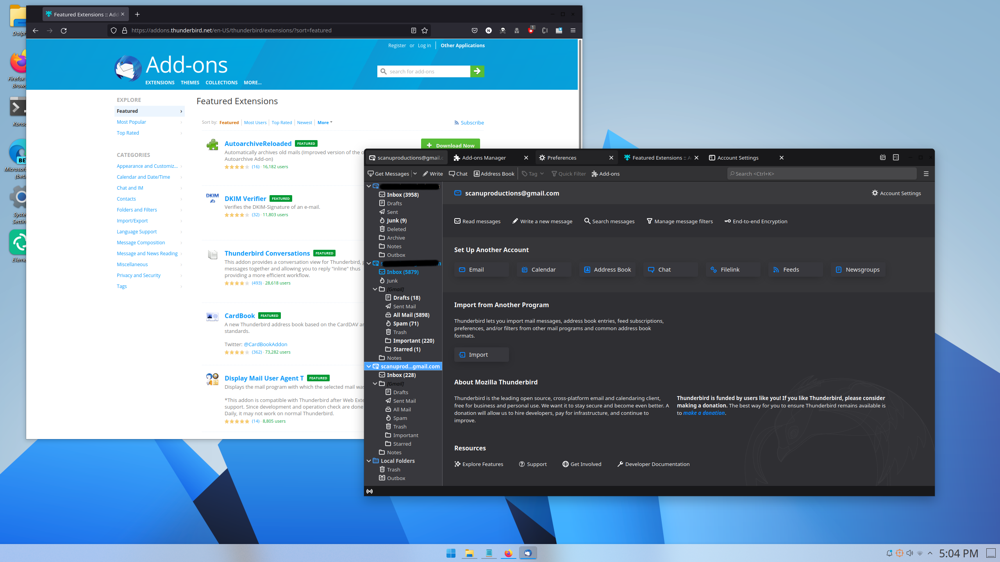

# Modern-ThunderBird
A userChrome.css theme to make Thunderbird (78+) resemble Firefox 89+

*Updated tabs and toolbar*

*Updated dropdown menus*

*Works with most themes other than the default light theme.*

## Installation

1. Download the file named userChrome.css from this repo.
2. Open Preferences and scroll all the way to the bottom of the General tab.
3. Click `Config Editor...`
4. A dialog will warn you, but ignore it, press the `I accept the risk!` button.
5. Enable the following flags by right clicking and selecting toggle:

	+ **`toolkit.legacyUserProfileCustomizations.stylesheets`**

5. Go to your Thunderbird profile.

	+ Linux - `$HOME/.thunderbird/XXXXXXX.default-XXXXXX/`.
	+ Windows 10 - `C:\Users\<USERNAME>\AppData\Roaming\Thunderbird\Profiles\XXXXXXX.default-XXXXXX`.
	+ macOS - `Users/<USERNAME>/Library/Application Support/Thunderbird/Profiles/XXXXXXX.default-XXXXXXX`.

6. Create a folder and name it **`chrome`**, then copy `userChrome.css` from step 1 to `chrome` folder.
7. Restart Thunderbird.

